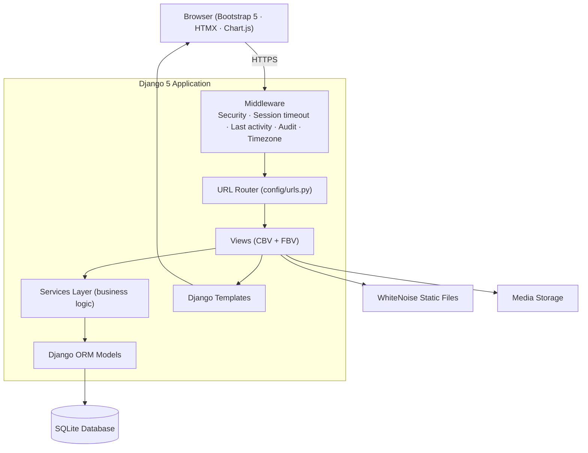

# Architecture Guide

## Overview

The Remote Worker Tracker System is a **modular Django monolith**. Every feature
area is an isolated Django application under `apps/`, communicating through
well-defined model relationships and a thin **services layer** rather than
reaching into each other's views. This keeps the system cohesive while remaining
easy to reason about, test and extend.

## Layers

### 1. Presentation (Templates + Static)
- Server-rendered Django templates in `templates/`.
- A single `base.html` layout with a collapsible sidebar, top navigation,
  notification centre, profile menu and light/dark theming.
- `static/css/app.css` implements the theme system via CSS custom properties;
  `static/js/app.js` handles theming, sidebar, toasts, timers, clock and Kanban
  drag-and-drop; `static/js/charts.js` wires Chart.js from JSON embedded with
  `{{ data|json_script }}`.

### 2. Views
- Thin controllers that validate input, enforce permissions (via
  `ModuleAccessMixin` / `module_required`) and delegate to services.
- Both class-based and function-based views are used where each is clearest.

### 3. Services (`services.py` per app)
- All non-trivial business logic lives here: clock in/out, timer management,
  productivity scoring, payroll generation, report building, notification
  dispatch, audit logging, etc.
- Services are plain functions — trivially unit-testable and reusable from views,
  management commands and signals.

### 4. Domain Models (ORM)
- Rich models with computed properties and domain methods.
- Shared abstract bases in `apps/core/models.py`:
  `TimeStampedModel`, `UUIDModel`, `SoftDeleteModel`, `AuditableModel`,
  `BaseModel`, `FullBaseModel`.
- Custom managers/querysets encapsulate common filters (e.g.
  `Employee.objects.search()`, `SoftDeleteManager`).

### 5. Cross-cutting Concerns
| Concern | Mechanism |
|---------|-----------|
| Authentication | Custom `accounts.User` (email login) + `EmailOrUsernameModelBackend` |
| Authorization | `apps/core/permissions.py`, `ROLE_MODULE_ACCESS` matrix, mixins & decorators |
| Auditing | `AuditLogMiddleware` (thread-local request) + `audit.services.log()` + auth signals |
| Presence & sessions | `SessionTimeoutMiddleware`, `LastActivityMiddleware`, `UserSession` |
| Notifications | `notifications.services.notify()` + context processor for the bell |
| Settings | `settings_app.CompanySettings` singleton, cached, exposed via context processor |

## Request Lifecycle

1. **Security & static** — `SecurityMiddleware` + WhiteNoise.
2. **Session & auth** — session load, user resolution.
3. **Session timeout** — logs out inactive users; refreshes activity timestamps.
4. **Audit** — stores the request in thread-local storage so signals can attribute
   changes to the acting user.
5. **Timezone** — activates the user's timezone.
6. **View** — permission checks → service calls → template render.
7. **Response** — messages flashed, audit entries written, notifications queued.

## Design Principles

- **SOLID / DRY / KISS** — small, single-purpose modules; shared bases & partials.
- **Fat services, thin views** — logic is testable in isolation.
- **Defensive aggregation** — dashboard/analytics services degrade gracefully
  (lazy imports + guarded queries) so a partially-seeded database never 500s.
- **Append-only audit** — `AuditLog.save()` blocks mutation after creation.
- **Progressive enhancement** — pages work without JS; HTMX/AJAX enrich them.

## Extending the System

To add a new module:
1. `python manage.py startapp <name>` inside `apps/` (or copy an existing app's
   layout).
2. Add it to `LOCAL_APPS` in `config/settings/base.py`.
3. Register its URLconf in `config/urls.py` with a namespace.
4. Add a navigation entry in `apps/core/context_processors.py` and a module key
   in `ROLE_MODULE_ACCESS`.
5. Build models → migrations → services → views → templates → tests.
