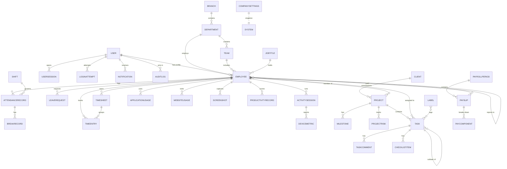

# Database & Entity-Relationship Guide

The system uses a normalized **SQLite** schema managed entirely through the
Django ORM and migrations. Foreign keys, unique constraints and indexes are
declared on the models; WAL journalling and foreign-key enforcement are enabled
at connection time (`apps/core/signals.configure_sqlite`).

## Core Entity-Relationship Diagram

## Key Tables

### Identity & Access
| Model | Purpose | Notable fields |
|-------|---------|----------------|
| `accounts.User` | Authentication identity | `email` (login), `role`, `two_factor_enabled`, `locked_until`, `last_activity` |
| `accounts.UserSession` | Active/historical logins | `session_key`, `ip_address`, `browser`, `is_active` |
| `accounts.LoginAttempt` | Login audit for lockout | `email`, `successful`, `reason` |
| `accounts.PasswordResetToken` / `EmailVerificationToken` | Single-use tokens | `token`, `expires_at`, `used_at` |

### Workforce
| Model | Purpose |
|-------|---------|
| `employees.Employee` | Central profile (1-1 with User) |
| `employees.Department` / `Team` / `Branch` / `JobTitle` / `Skill` | Org structure |
| `employees.SalaryInformation` / `TaxInformation` / `BankInformation` | Compensation |
| `employees.Contract` / `Document` / `Education` / `Certification` / `Device` | HR records |

### Time & Presence
| Model | Purpose |
|-------|---------|
| `attendance.AttendanceRecord` | One row per employee per day (unique) |
| `attendance.BreakRecord` | Breaks within a day |
| `attendance.LeaveRequest` | Leave with approval workflow |
| `timetracking.TimeEntry` / `Timesheet` | Tracked work + approvals |

### Monitoring & Productivity
| Model | Purpose |
|-------|---------|
| `monitoring.ActivitySession` | A monitored work session |
| `monitoring.ApplicationUsage` / `WebsiteUsage` | Aggregated daily usage (unique per employee/day/name) |
| `monitoring.DeviceMetric` | CPU/RAM/disk/battery/network telemetry |
| `screenshots.Screenshot` | Capture metadata + optional image/thumbnail |
| `productivity.ProductivityRecord` | Daily scorecard (unique per employee/day) |

### Delivery
| Model | Purpose |
|-------|---------|
| `projects.Project` / `Client` / `Milestone` / `ProjectRisk` | Project management |
| `tasks.Task` / `TaskComment` / `ChecklistItem` / `Label` | Kanban delivery |

### Finance, Comms & Audit
| Model | Purpose |
|-------|---------|
| `payroll.PayrollPeriod` / `Payslip` / `PayComponent` | Payroll |
| `notifications.Notification` / `Announcement` / `NotificationPreference` | Messaging |
| `audit.AuditLog` | Immutable action log |
| `reports.Report` | Generated report history |
| `analytics.KPISnapshot` | Daily KPI snapshots |
| `settings_app.CompanySettings` (+ policies) | Configuration |

## Indexing Strategy

Composite indexes back the hottest query paths, e.g.:
- `Employee(status, online_status)` and `(department, team)`
- `AttendanceRecord(date, status)` and `(employee, -date)`
- `Task(status, order)` and `(project, status)`
- `AuditLog(action, module)` and `(actor, -created_at)`
- `Notification(recipient, is_read)`

## Migrations & Fixtures

- Each app owns its `migrations/` package; create with `makemigrations` and apply
  with `migrate`.
- Realistic sample data is generated programmatically by the
  [`seed_data`](../apps/core/management/commands/seed_data.py) command rather than
  static fixtures, which keeps the dataset coherent and relational.
- Portable JSON dumps can be produced with `python manage.py backup_db` (uses
  `dumpdata` under the hood).
